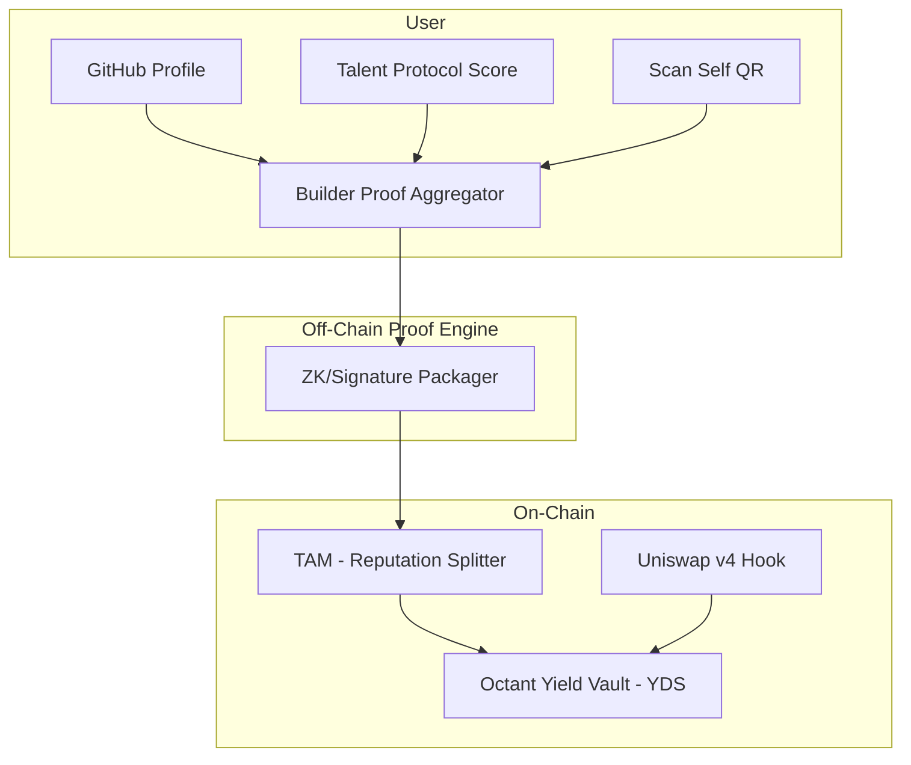

# Design Document

## Overview

This MVP implements a vault system in Octant v2 where the generated yield can only be claimed by wallets that present valid reputation proofs as builders. Proofs are obtained from trusted external sources: GitHub (public profile), Talent Protocol (builder score), and Self (human verification). The vault is funded with yield from a Uniswap v4 hook.

The design is divided into three layers:
1. **Yield generation (on-chain)**: via Uniswap v4 Hook → Yield Donating Strategy (YDS)
2. **Reputational validation (off-chain → on-chain)**: through collected and verified proofs
3. **Scheduled yield distribution (on-chain)**: using a Tokenized Allocation Mechanism (TAM) that releases funds proportional to the reputation score

---

## Architecture

